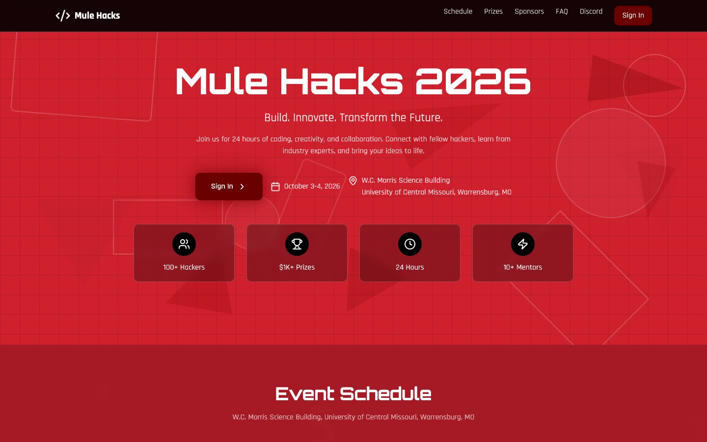
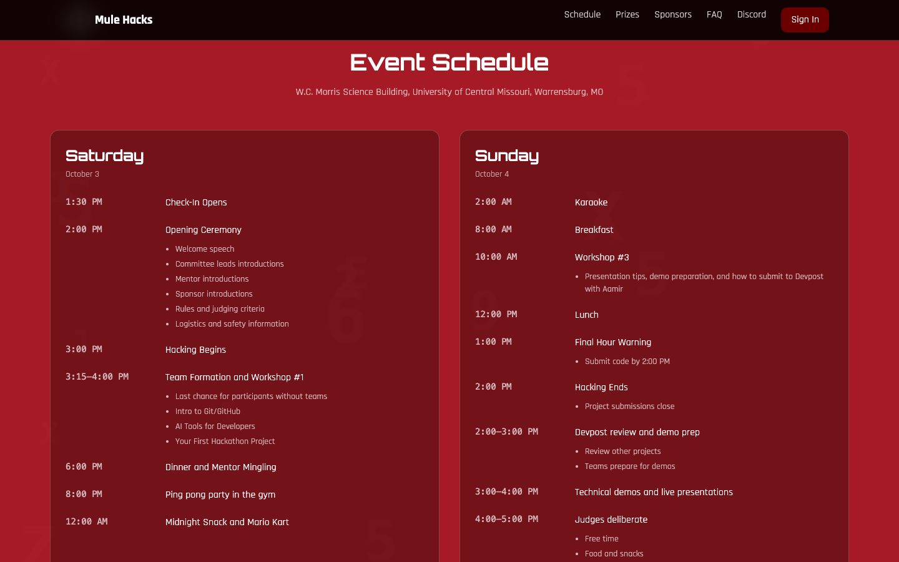
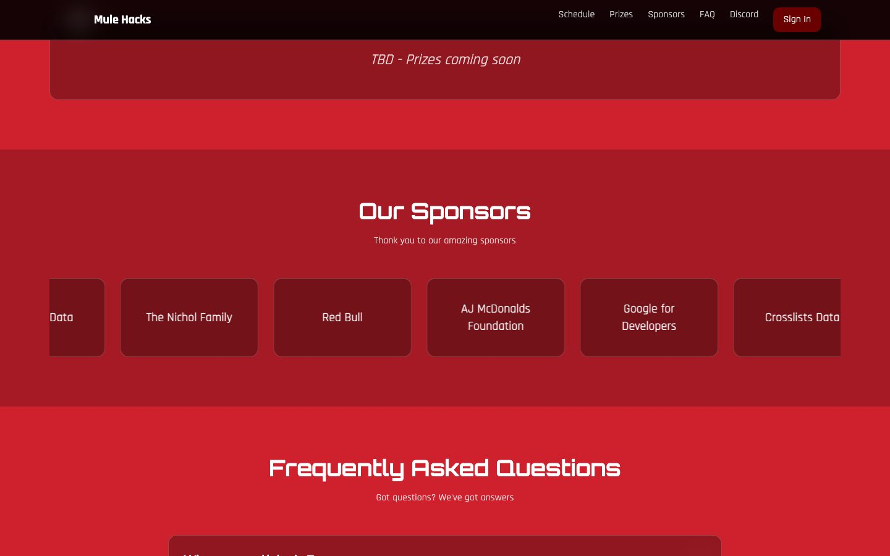
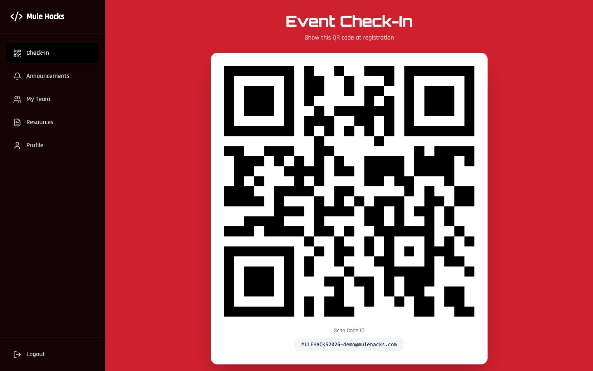
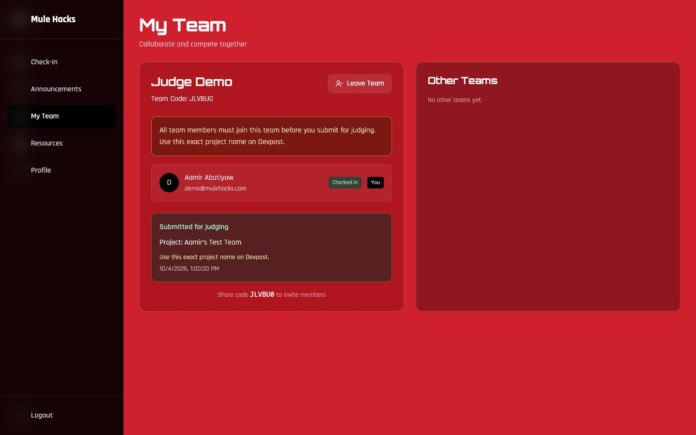

# MuleHacks Hacker App

The event site, registration flow, check-in desk, and judging console for Mule Hacks, a 24-hour student hackathon at the University of Central Missouri on October 3–4, 2026.

<p align="center">
  
</p>

<p align="center">
  
</p>

<p align="center">
  
</p>

## What shipped

When the room filled, general registration closed on the public site while a private late-registration link still walked a leftover group through the same onboarding. **94** students created accounts and **90** finished onboarding, with shirt sizes, dietary notes, and a signed code of conduct attached to each profile.

Organizers ran the door from one shared scanner login. Each person typed their name once, then scanned a participant QR or typed an email to log arrival, meals, workshops, and building re-entry. That desk recorded **186** station scans for **62** hackers who checked in at arrival (65 arrival, 53 dinner, 32 midnight snack, 25 breakfast, 9 lunch, 2 workshop).

Hackers formed **28** teams in the dashboard, invited teammates with a short code, and could leave or drop a member before judging. **23** teams submitted a project name for judging after every current member had an arrival check-in, using the same title they put on Devpost.

Judges shared one login, typed their own names, and scored submitted teams on a six-category rubric for Devpost and live demo as separate sheets. **9** judges filed **95** score sheets (69 live demos and 26 Devpost reviews). The admin console averaged every sheet per team so organizers could read a 30-point total without opening each rubric.

<p align="center">
  
</p>

<p align="center">
  
</p>

## Stack

React and Vite on the client, Express and MongoDB Atlas on the server, previously deployed on Fly.io.

## Run locally

```bash
npm install
cp .env.example .env
npm run dev
```

In a second terminal, `npm run api` serves the Express API. Copy `.env.example` and fill in MongoDB, JWT, and the admin / scanner / judge seed accounts. Do not commit `.env`.
